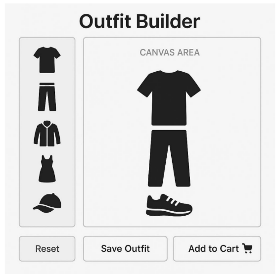

# Outfit Builder

### Objective
We aim to develop a web-based WYSIWYG (What You See Is What You Get) editor using
**Next.js** that allows users to visually mix and match different clothing items by dragging and
dropping individual clothing icons into a virtual canvas. The goal is to enable users to see
how different clothing combinations look together in real time.

>Demo Link: 

## Design 


### Usage 

``` 
git clone <github repository link>  //to clone the github repository
npm install                         //to install all the dependencies required to run the application
npm run dev                           //to start the application
```  

## Key features:
1. **Drag-and-Drop Interface**: Users can drag individual clothing item icons (provided as
assets) onto a virtual model or canvas to create outfit combinations.
2. **Visual Outfit Assembly**: The editor will allow users to layer and position clothing
items to visualize full outfits.
3. **Selection and Cart Integration**: Once a user is satisfied with a clothing combination,
they can select that outfit and add it to a shopping cart for purchase.
4. **Next.js Framework**: The application will be built using Next.js to ensure high
performance, server-side rendering, and scalability.

* The solution should provide a smooth, interactive, and intuitive user experience to help
customers confidently put together and purchase complete outfit combinations online.

* A sample virtual canvas is provided below for reference – a new one needs to be developed
which is user intuitive. The icons to be used are provided in the attached zip file.

###  Expected output :
A fully functional Next.js project implementing the outfit builder with:
* A drag-and-drop interface
* Clothing icons
* Canvas to compose outfits
* "Add to cart" button logic

## Guidelines

* Followed Github Guidelines
  * Made the commits often and made sure the commit messages are concise and specific
  * Included a README file for explaining the project setup, usage instructions, and any additional information
* Followed Clean Code Guidelines
* The repo is well-organized and easy to navigate 
  * Followed the [create-next-app] folder structure
* The Application handled all the errors